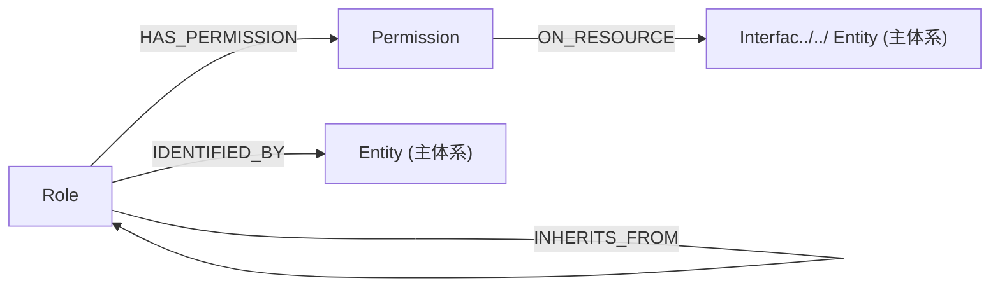

# RBAC — 访问控制子系统

## 设计原则

本子系统遵循 NIST RBAC 模型（含角色继承），为主制品体系提供"谁可以做什么"的结构化定义。

1. **RBAC1（层级模型）**：Role 支持 `inherits_from_id` 单继承，子角色自动获得父角色的全部 Permission。
2. **Permission = Action × Resource**：每条 Permission 精确到一个动作（INVOK../../ REA../../ WRIT../../ DELETE）在一个资源（Interfac../../ Entity）上的效果（ALLO../../ DENY）。
3. **显式否定优先**：同一 Role 对同一资源同时存在 ALLOW 和 DENY 时，DENY 优先。
4. **引用主体系 ID**：Permission 的 `resource_id` 直接引用主制品体系的 `API-\d+../../ `ENT-\d+`，不另建资源目录。

---

## 制品总览

| 制品类型 | ID 模式 | 文件 | 用途 |
|---------|---------|------|------|
| [Role](role.md) | `ROLE-\d+` | `role.md` | 参与者角色——身份条件、权限集合、继承关系 |
| [Permission](permission.md) | `PERM-\d+` | `permission.md` | 授权条目——动作 × 资源 × 效果 |

---

## 关系图

---

## 关系边类型

| 边类型 | 起点 | 终点 | 语义 |
|--------|------|------|------|
| `HAS_PERMISSION` | Role | Permission | 角色拥有该授权条目 |
| `INHERITS_FROM` | Role | Role | 子角色继承父角色的全部权限 |
| `IDENTIFIED_BY` | Role | Entity | 角色对应的主体实体 |
| `ON_RESOURCE` | Permission | Interfac../../ Entity | 授权作用于哪个资源 |

---

## 与主制品体系的接口

| 主体系制品 | 引用方式 | 说明 |
|-----------|---------|------|
| [Requirement](../../requirement/requirement.md) | `actor_role_id: ROLE-\d+` | 需求的执行角色 |
| [User Story](../../requirement/user-story.md) | `actor_role_id: ROLE-\d+` | 用户故事的执行角色 |
| [Interface](../../contract/interface.md) | `role_ids: ROLE-\d+` | 接口的授权角色 |
| [Entity](../../contract/entity.md) | `← Role.entity_id` | 角色身份实体 |
| [Interface](../../contract/interface.md) | `← Permission.resource_id` | 受控接口 |
